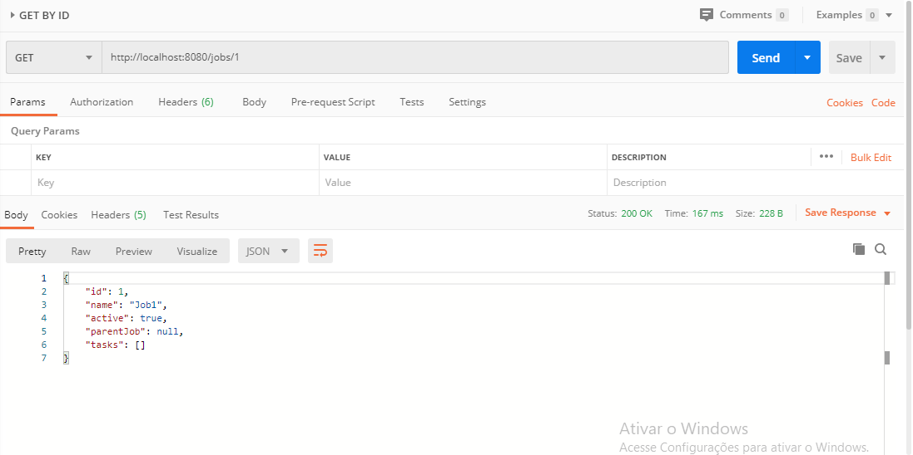

# **API JOB MANAGER**

# Resources used

*  Database H2
*  Swagger - http://localhost:8080/swagger-ui.html#/
*  JPA/HIBERNATE
*  Maven

# Build Instructions

*  O start da aplicação deve ser feito com o Maven command: mvn spring-boot:run
*  Suíte de testes não criada;
*  As rotas foram testadas via Postman.

# Examples /tasks

*  POST 

*  GET 
*  Obs.: Houve um problema com datas enviadas via Postamn. Então para pesquisar uma tarefa do dia 2015-05-23 deve-se colocar 2015-05-22.

# Examples /tasks/{id}

*  GET 

*  PUT 

*  DELETE 

# Examples /jobs

*  POST 

*  GET 

# Examples /jobs{id}

*  GET 

*  DELETE 

# Validating job structure

# Success
* JOB1

* JOB2

* JOB3

# JSON
* JOB1
`{
  "id": 1,
  "name": "Job1",
  "active": true,
  "parentJob": {
    "id": 2,
    "name": "Second job",
    "active": true
  },
  "tasks": [
    {
      "id": 1,
      "name": "First task",
      "weight": 5,
      "completed": true,
      "createdAt": "2015-05-23"
    },
    {
      "id": 2,
      "name": "Second task",
      "weight": 2,
      "completed": false,
      "createdAt": "2017-05-23"
    }
  ]
}`
* JOB3
`{
  "id": 3,
  "name": "Job3",
  "active": true,
  "parentJob": {
    "id": 1,
    "name": "Job1",
    "active": true
  },
  "tasks": [
    {
      "id": 3,
      "name": "third task",
      "weight": 5,
      "completed": true,
      "createdAt": "2015-05-23"
    },
    {
      "id": 4,
      "name": "fourth task",
      "weight": 2,
      "completed": false,
      "createdAt": "2017-05-23"
    }
  ]
}`
* JOB5
`{
    "id": 5,
    "name": "Job5",
    "active": true,
    "parentJob": {
        "id": 3,
        "name": "Job3",
        "active": true
    },
    "tasks": [
        {
            "id": 5,
            "name": "fifth task",
            "weight": 5,
            "completed": true,
            "createdAt": "2015-05-22"
        },
        {
            "id": 6,
            "name": "sixth task",
            "weight": 2,
            "completed": false,
            "createdAt": "2017-05-22"
        }
    ]
}`

# Error
* JOB1

* JOB2

* JOB2

# JSON

* JOB1
`{
  "id": 1,
  "name": "Job1",
  "active": true,
  "parentJob": {
    "id": 3,
    "name": "Job3",
    "active": true
  },
  "tasks": [
    {
      "id": 1,
      "name": "First task",
      "weight": 10,
      "completed": true,
      "createdAt": "2015-05-23"
    },
    {
      "id": 2,
      "name": "Second task",
      "weight": 5,
      "completed": false,
      "createdAt": "2017-05-23"
    }
  ]
}`
* JOB2
`{
  "id": 2,
  "name": "Job2",
  "active": true,
  "parentJob": {
    "id": "1",
    "name": "Job1",
    "active": true
  },
  "tasks": [
    {
      "id": 3,
      "name": "third task",
      "weight": 5,
      "completed": true,
      "createdAt": "2015-05-23"
    },
    {
      "id": 4,
      "name": "fourth task",
      "weight": 2,
      "completed": false,
      "createdAt": "2017-05-23"
    }
  ]
}`
* JOB2
`{
  "id": 2,
  "name": "Job2",
  "active": true,
  "parentJob": {
    "id": 2,
    "name": "Job2",
    "active": true
  },
  "tasks": [
    {
      "id": 5,
      "name": "First task",
      "weight": 5,
      "completed": true,
      "createdAt": "2015-05-23"
    },
    {
      "id": 6,
      "name": "Second task",
      "weight": 2,
      "completed": false,
      "createdAt": "2017-05-23"
    }
  ]
}`